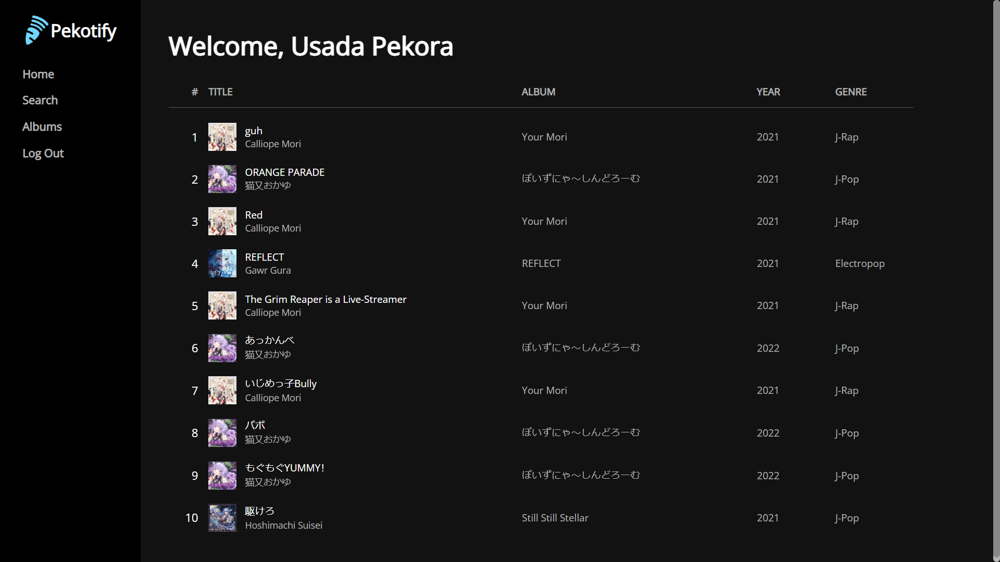
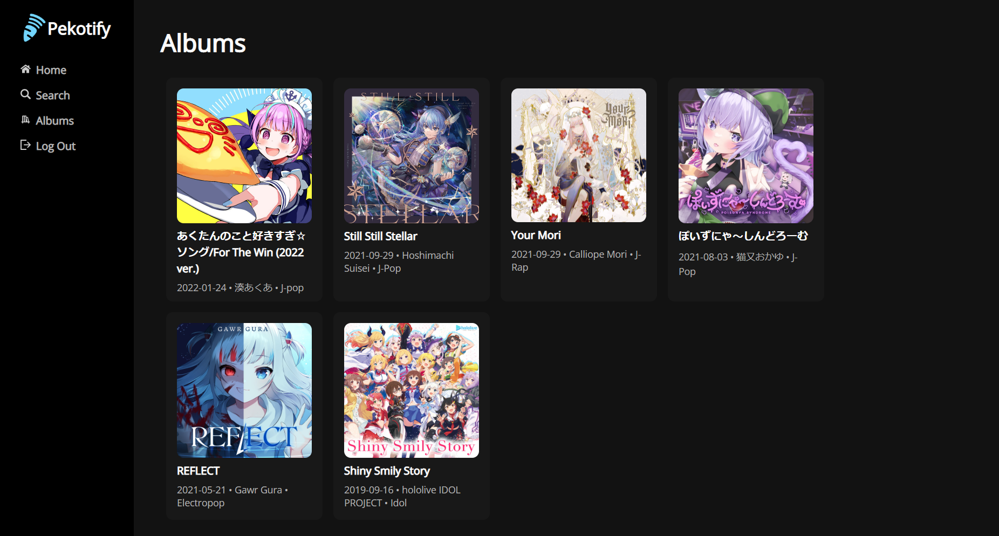
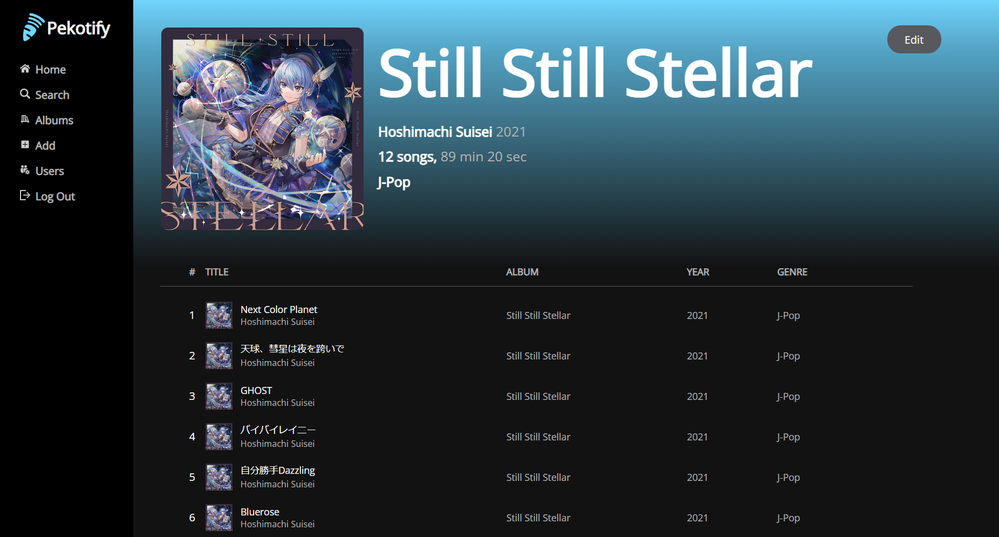
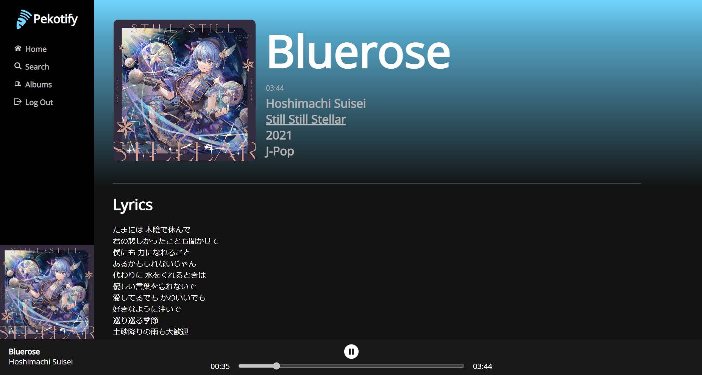
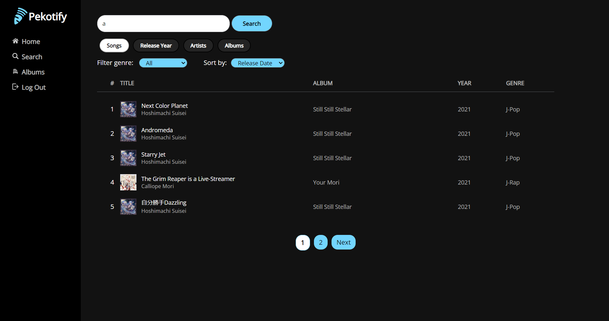

<!-- PROJECT LOGO -->
<br />
<div align="center">
  <a href="https://github.com/othneildrew/Best-README-Template">
    
  </a>

  <h3 align="center">Pekotify</h3>

  <p align="center">
    An open source spotify-like web app
  </p>
</div>


<!-- ABOUT THE PROJECT -->
## About The Project








Project ini dikerjakan untuk memenuhi Tugas Besar IF3110 Pemrograman Berbasis Web


### Built By
- Rozan Fadhil Al Hafidz - 13520039
- Andreas Indra Kurniawan - 13520091
- Zayd Muhammad Kawakibi Zuhri - 13520144


### Built With

Project ini dibuat dengan


## Getting Started

Project ini dijalankan dengan menggunakan docker. 
### Prerequisites

- Docker Desktop

### Installation
1. Build docker image dengan command berikut
   ```sh
   docker build -t tubes-1:latest .
   ```
2. Jalankan command berikut untuk menjalankan docker container
   ```sh
   docker compose up
   ```
3. Import database/dump.sql di MySQL yang berjalan di localhost:3306 
4. Buka Pekotify dengan alamat http://localhost:8008/ di browser

### Additional Features
- Lyrics
- Adjustable Progress Bar
- Usada Pekora Theme

### Work Distribution
#### Server-side
- Login : 13520144
- Register : 13520144
- User List : 13520144
- Edit Song : 13520144
- Home : 13520039
- Search : 13520039
- Album List : 13520039
- Navbar : 13520039
- Song Detail : 13520091
- Music Player : 13520091
- Album Detail : 13520091
- Add Album : 13520091
- Add Song : 13520091
- Edit Album : 13520091

#### Client-side
- Login : 13520144
- Register : 13520144
- User List : 13520144
- Edit Song : 13520144
- Home : 13520039
- Search : 13520039
- Album List : 13520039
- Navbar : 13520039
- Song Detail : 13520091
- Music Player : 13520091
- Album Detail : 13520091
- Add Album : 13520091
- Add Song : 13520091
- Edit Album : 13520091
